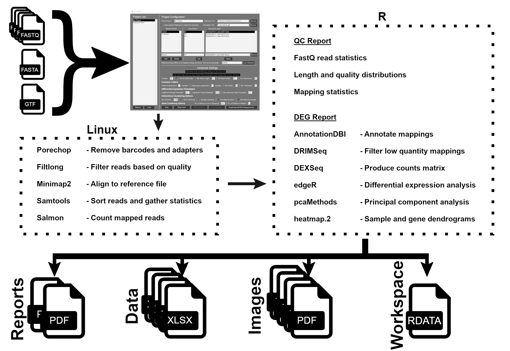

# NanoSTAR

<!-- HEADER -->
 

    
  

    Multiplatform resource to take fastq files from Nanopore cDNA sequencing to DEG lists and more.
     
  

<!-- TABLE OF CONTENTS -->

  
<h2 style="display: inline-block">Table of Contents</h2>

  <ol>
    <li><a href="#about">About</a></li>
    <li><a href="#getting-started">Getting Started</a>
      <ul>
        <li><a href="#requirements">Requirements</a></li>
        <li><a href="#installation">Installation</a></li>
      </ul>
    </li>
    <li><a href="#usage">Usage</a></li>
    <li><a href="#output">Output</a></li>
  </ol>

<!-- ABOUT -->
## About
NanoSTAR brings together several publically available tools for the analysis for Nanopore sequenced transcriptomes. Given fastq sample files, reference files,
and details of study design, NanoSTAR will process and analyse your data.

Upon completion, NanoSTAR will produce two comprehensive reports as well as other output,
including excel sheets of differential expression, genelists, heatmaps, dendograms, and more!

NanoSTAR also runs a series of useful processes to gather statistics for the evaluation of the quality of read data you have provided.

    

<!-- GETTING STARTED -->
## Getting Started

### Requirements

* Linux or Windows 10+

### Installation

To get a local copy up and running follow [these simple steps](https://github.com/lab-rat-kid/NanoSTAR/blob/main/docs/NanoSTAR%20Installation%20Documentation.pdf).

<!-- USAGE -->
## Usage

To use NanoSTAR is simple, and detailed in [this document](https://github.com/lab-rat-kid/NanoSTAR/blob/main/docs/NanoSTAR%20User%20Guide.pdf).

Test data can be downloaded [here](https://www.dropbox.com/s/xyibpyiavr9t22t/test%20data.zip?dl=0)

<!-- OUTPUT -->
## Output

NanoSTAR gives a wide range of output. The core output is two pdf documents (a [QC report](https://github.com/lab-rat-kid/NanoSTAR/blob/main/examples/NanoSTAR_QC_Report.pdf)
and a [DGE report](https://github.com/lab-rat-kid/NanoSTAR/blob/main/examples/NanoSTAR_DGE_Report.pdf)). These are accompanied by
a series of excel spreadsheets containing raw and filtered counts, differential expression data, and significant gene lists, and
a range of images to visualise your data, including violin plots, PCA plots, heatmaps, and dendrograms:

    
